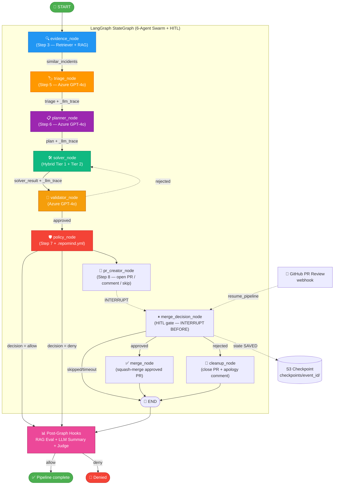
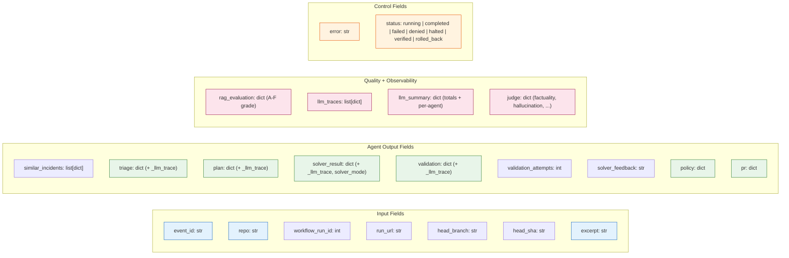

# LangGraph Pipeline — 6-Agent Swarm + HITL (V2)

> **File:** `agents/graph.py` · **State:** `agents/models.py` · **Nodes:** `agents/nodes.py`
> **Deep Solver:** `agents/deep_solver.py` · **LLM-as-Judge:** `agents/llm_judge.py`
> **HITL nodes (V2):** `agents/hitl_nodes.py` · **Checkpointer (V2):** `agents/checkpointer.py`
> **Review handler (V2):** `review/review_handler.py`

> **V2 callout:** the graph now extends beyond `policy` to include `pr_creator → merge_decision → merge | cleanup`. The graph **interrupts before `merge_decision`**, persists state to S3, and waits for a GitHub PR review to resume. See [§1a](#1a-hitl-interrupt-mechanics).

---

## 1. Pipeline Flow (V2)



**Key edges:**

- `evidence → triage → planner → solver → validator` (linear)
- `validator → policy` (when validation status = `approved`)
- `validator → solver` (when validation status = `rejected` AND `validation_attempts < 2`) — **conditional retry edge**
- `policy → pr_creator` (always)
- `pr_creator → [INTERRUPT] → merge_decision` (HITL pause point, V2)
- `merge_decision → merge` (verdict = `approved`)
- `merge_decision → cleanup` (verdict = `rejected`)
- `merge_decision → END` (verdict = `skipped` / `timeout` / mode = `dry_run`)

---

## 1a. HITL Interrupt Mechanics (V2)

```
┌────────────────────────────────────────────────────────────────────┐
│ LAMBDA INVOCATION #1 — failure event arrives                       │
│  ┌──────────────────────────────────────────────────────────────┐  │
│  │ evidence → triage → planner → solver → validator → policy    │  │
│  │ → pr_creator_node (opens PR, stores pr_url in state)         │  │
│  │ → [interrupt_before merge_decision]                          │  │
│  │ → checkpointer.put(state) → writes JSON to                   │  │
│  │   s3://repomind-data/checkpoints/<event_id>/<ckpt_id>.json   │  │
│  │ → graph returns {status: "awaiting_review"}                  │  │
│  └──────────────────────────────────────────────────────────────┘  │
│ Lambda exits.                                                       │
└────────────────────────────────────────────────────────────────────┘

                    ⏳ HOURS or DAYS pass ⏳

┌────────────────────────────────────────────────────────────────────┐
│ LAMBDA INVOCATION #2 — GitHub fires pull_request_review            │
│  ┌──────────────────────────────────────────────────────────────┐  │
│  │ webhook/webhook_handler.py  → SQS                              │  │
│  │ worker/main.py routes "review" → review/review_handler.py   │  │
│  │ → lookup_event_id_for_pr(repo, pr_number) ← S3 index         │  │
│  │ → map "approved" / "changes_requested" → ReviewVerdict       │  │
│  │ → resume_pipeline(event_id, human_approval, review_data)     │  │
│  │ → graph.update_state({"human_approval": verdict, ...})       │  │
│  │ → graph.invoke(None) → LangGraph picks up at merge_decision  │  │
│  │ → merge_decision routes to merge OR cleanup                  │  │
│  │ → state["status"] = "completed"                              │  │
│  └──────────────────────────────────────────────────────────────┘  │
└────────────────────────────────────────────────────────────────────┘
```

### Why S3 (not MemorySaver)?

| Constraint                  | Implication                                  |
|-----------------------------|----------------------------------------------|
| AWS Lambda max timeout      | 15 minutes — can't hold state in-process     |
| Human review latency        | Hours to days                                |
| Multi-invocation continuity | State must live outside the Lambda runtime   |

`S3CheckpointSaver(BaseCheckpointSaver)` in `agents/checkpointer.py` solves this. In local dev with no `S3_BUCKET` set, factory `get_checkpointer()` returns LangGraph's in-memory `MemorySaver` (fine for unit tests, not production).

**Checkpoint layout:**

```
s3://repomind-data/
  checkpoints/<event_id>/
    <checkpoint_id>.json     ← serialized PipelineState
    latest.txt               ← pointer to most recent checkpoint
  indexes/by-pr/<owner>-<repo>/
    <pr_number>.json         ← { "event_id": "evt-..." }
```

### Why PR↔Event mapping?

When `pr_creator_node` opens a PR, the worker writes `indexes/by-pr/<owner>-<repo>/<pr_number>.json` containing the originating `event_id` (= LangGraph `thread_id`). Without this, `review/review_handler.py` would have no way to find the right paused graph when a reviewer comments — it only sees `repo + pr_number` in the webhook payload.

### `with_hitl=True` vs `with_hitl=False`

`get_graph(with_hitl=True)` is the default (production). For pure synchronous local testing (`run_local.py` in `--sequential` mode), `with_hitl=False` returns a variant **without** the `interrupt_before` — HITL nodes still run, but the graph completes in one shot using `human_approval` already injected into the input state.

---

## 2. Conditional Retry Logic

The `should_retry_solver()` router function (in `agents/graph.py`) inspects `state["validation"]["status"]` and `state["validation_attempts"]` to decide:

```python
def should_retry_solver(state: PipelineState) -> str:
    validation = state.get("validation", {})
    attempts = state.get("validation_attempts", 0)

    if validation.get("status") == "rejected" and attempts < 2:
        return "solver"   # Loop back with feedback in state["solver_feedback"]
    return "policy"       # Approved (or out of retries) → proceed
```

**Maximum 2 retries** — after that the graph proceeds to policy with the last attempt regardless of validator's verdict.

---

## 3. Node Details

### Node 1: `evidence_node` (Step 3 — Evidence Retrieval)

| Property | Value |
|----------|-------|
| **Reads** | `state["excerpt"]`, `state["repo"]` |
| **Writes** | `state["similar_incidents"]` |
| **Module** | `rag.retriever.Retriever` |
| **LLM call** | None |
| **On Failure** | Non-fatal — returns empty list `[]` |

Retrieves top-K similar past CI failures from **Qdrant** vector DB for RAG context.

---

### Node 2: `triage_node` (Step 5 — Failure Classification)

| Property | Value |
|----------|-------|
| **Reads** | `state["excerpt"]`, `state["repo"]`, `state["similar_incidents"]` |
| **Writes** | `state["triage"]` (incl. `_llm_trace`) |
| **Module** | `triage.triage.classify()` |
| **LLM call** | Azure GPT-4o (JSON mode, temp=0.1) via `traced_completion` |
| **RAG context** | Top-3 similar past failures injected into prompt |
| **On Failure** | Falls back to keyword heuristic |

Classifies the CI failure type using Azure GPT-4o + RAG context from past incidents.

---

### Node 3: `planner_node` (Step 6 — Fix Plan Generation)

| Property | Value |
|----------|-------|
| **Reads** | `state["triage"]`, `state["excerpt"]`, `state["repo"]`, `state["similar_incidents"]` |
| **Writes** | `state["plan"]` (incl. `_llm_trace`) |
| **Module** | `planner.planner.generate_plan()` |
| **LLM call** | Azure GPT-4o (JSON mode, temp=0.2, max 1500 tokens) via `traced_completion` |
| **RAG context** | Top-2 similar past fixes injected into prompt |
| **On Failure** | Falls back to template plan |

Generates a fix plan with playbook ID, actions, and target files.

---

### Node 4: `solver_node` (Step 4 — Hybrid Code Generator)

| Property | Value |
|----------|-------|
| **Reads** | `state["triage"]`, `state["plan"]`, `state["excerpt"]`, `state["solver_feedback"]` (on retry) |
| **Writes** | `state["solver_result"]` (incl. `_llm_trace`, `solver_mode`) |
| **Module** | `agents.deep_solver.run_deep_solver()` (Tier 1) → `agents.nodes._direct_llm_solver()` (Tier 2) |
| **LLM call** | **Tier 1:** Azure GPT-4o via `langchain-openai` + `deepagents` (multi-step tool use, temp=0.2)<br/>**Tier 2:** Azure GPT-4o via `traced_completion` (single shot, JSON mode, temp=0.2) |
| **Tools (Tier 1)** | `read_repo_file`, `list_repo_directory`, `search_repo_code` (8 reads max, 50 KB/file) |
| **Sub-agents (Tier 1)** | `code-reader` (file inspection), `diff-writer` (diff generation) |
| **Timeout (Tier 1)** | 45 seconds wall-clock |
| **Fallback** | Tier 2 fires when Tier 1 times out, errors, or returns empty `code_changes` |

**Tier tagging:** Every result carries `solver_mode` = `"deep_agent"` (Tier 1 success) or `"direct_llm"` (Tier 2 fallback).

---

### Node 5: `validator_node` (Step 4 — Peer Review)

| Property | Value |
|----------|-------|
| **Reads** | `state["solver_result"]`, `state["plan"]`, `state["triage"]` |
| **Writes** | `state["validation"]` (incl. `_llm_trace`), `state["validation_attempts"]++`, `state["solver_feedback"]` (if rejected) |
| **Module** | `agents.nodes.validator_node()` |
| **LLM call** | Azure GPT-4o (JSON mode, temp=0.1) via `traced_completion` |
| **Decision** | `status = "approved" \| "rejected"` |
| **On Failure** | Defaults to `"approved"` with low confidence (does not block pipeline) |

---

### Node 6: `policy_node` (Step 7 — Safety Policy)

| Property | Value |
|----------|-------|
| **Reads** | `state["triage"]`, `state["plan"]`, `state["repo"]` |
| **Writes** | `state["policy"]`, `state["status"]` |
| **Module** | `policy_engine.policy.PolicyEngine` |
| **LLM call** | None — pure rule-based YAML evaluation |
| **On Failure** | Fail-closed — `decision = "deny"` |

If **denied**, the pipeline stops (no PR is created).

---

## 4. Post-Graph Hooks

After the LangGraph completes, three hook functions run sequentially in `agents/graph.py`:

| Hook | Function | Writes |
|------|----------|--------|
| 📊 **RAG Quality** | `_attach_rag_report(state)` | `state["rag_evaluation"]` (A–F grade + sub-scores) |
| 💰 **LLM Summary** | `_collect_llm_traces(state)` | `state["llm_summary"]` (totals + per-agent breakdown) |
| 🛡️ **LLM-as-Judge** | `_run_llm_judge(state)` | `state["judge"]` (factuality + completeness + calibration + hallucination flag) |

The judge is **independent** — it does NOT participate in the swarm. It runs once after the graph completes, makes a single Azure GPT-4o call, and produces a verdict on the swarm's triage output. Toggle via `LLM_JUDGE_ENABLED=false` to skip.

---

## 5. State Schema (`PipelineState`)



---

## 6. End-to-End Data Flow

```
┌────────────┐  excerpt   ┌──────────┐  similar_incidents  ┌──────────┐  triage     ┌──────────┐
│  Worker    │ ─────────► │ evidence │ ──────────────────► │  triage  │ ──────────► │ planner  │
│ (Step 2)   │            │ (Step 3) │                     │ (Step 5) │             │ (Step 6) │
└────────────┘            └──────────┘                     └──────────┘             └─────┬────┘
                                                                                          │ plan
                                                                                          ▼
                                       ┌──────────┐  validation   ┌──────────┐  solver_result
                                       │ policy   │ ◄──approved── │validator │ ◄────────────  ┌──────────┐
                                       │ (Step 7) │               │ (Step 4) │                │  solver  │
                                       └─────┬────┘               └────┬─────┘                │ (Step 4) │
                                             │                         │ rejected             │ Tier 1+2 │
                                             │                         └─────retry ──────────►└──────────┘
                                             │                              (max 2x)
                                             │ allow / deny
                                             ▼
                                  ┌──────────────────────┐
                                  │  Post-Graph Hooks    │
                                  │  • RAG eval          │
                                  │  • LLM summary       │
                                  │  • LLM-as-Judge      │
                                  └──────────┬───────────┘
                                             │
                              ┌──────────────┴──────────────┐
                              │                             │
                         allow ▼                            ▼ deny
                  ┌────────────────┐               ┌─────────────────┐
                  │   Step 9       │               │      STOP       │
                  │ Quality Gate   │               │    (denied)     │
                  └─────┬──────────┘               └─────────────────┘
                        │
              pass ┌────┴────┐ blocked
                   ▼         ▼
          ┌────────────┐  ┌──────────┐
          │  Step 8    │  │  STOP    │
          │ PR Creator │  │(quality) │
          └─────┬──────┘  └──────────┘
                │ fix/* branch triggers CI re-run
                ▼
          ┌────────────┐
          │  Step 10   │
          │ Verifier   │
          └─────┬──────┘
                │
       CI passed ┌────┴────┐ CI failed
                 ▼         ▼
           ┌──────────┐  ┌──────────────┐
           │ verified │  │   Rollback   │
           │    ✅    │  │ (revert PR)  │
           └──────────┘  └──────────────┘

     Step 11 (Observability) runs throughout:
     ├── Kill switch checked at pipeline start
     ├── Pipeline metrics recorded at each step
     ├── LLM metrics recorded by traced_completion at every LLM call
     └── All metrics pushed to Pushgateway at end
```

---

## 7. Execution Modes

| Mode | When | How |
|------|------|-----|
| **LangGraph (preferred)** | `langgraph` package installed (>= 0.3.4) | `StateGraph.compile().invoke(state)` with conditional edges |
| **Sequential Fallback** | LangGraph missing or fails | `_sequential_run()` calls all 6 nodes in order (with retry loop manually implemented) |

Both modes use the **same nodes**, **same state**, **same retry logic** — identical results.

---

## 8. Entry Point

```python
from agents.graph import run_pipeline

result = run_pipeline(
    event_id="evt-abc123",
    repo="user/mlproject",
    workflow_run_id=12345,
    run_url="https://github.com/user/mlproject/actions/runs/12345",
    excerpt="ModuleNotFoundError: No module named 'pandas'",
)

# Inspect agent outputs
print(result["triage"]["failure_type"])           # "dependency_error"
print(result["solver_result"]["solver_mode"])     # "deep_agent" or "direct_llm"
print(result["validation"]["status"])             # "approved" or "rejected"
print(result["validation_attempts"])              # 0, 1, or 2

# Inspect quality
print(result["rag_evaluation"]["grade"])          # "A".."F"
print(result["llm_summary"]["total_cost_usd"])    # 0.0601
print(result["judge"]["overall_grade"])           # "A".."F"
print(result["judge"]["hallucination_flag"])      # True / False

# Decide
if result["policy"]["decision"] == "allow":
    # Proceed to Step 8 — PR Creation
    pass
```

---

## 9. Why This Design?

| Choice | Rationale |
|--------|-----------|
| **6-agent swarm (not 4)** | Solver/Validator separation enables a self-correction loop without humans in the path |
| **Conditional retry edge** | Validator can reject solver output and trigger rework — capped at 2 retries to bound latency/cost |
| **Hybrid Tier 1 + Tier 2 solver** | Tool-using deep agent for accuracy + direct LLM fallback for reliability |
| **Tool budget on Tier 1** | 8 reads × 50 KB cap keeps Lambda cold-starts predictable and cost bounded |
| **Judge as post-graph hook** | Avoids feedback loops in the swarm itself; pure observability |
| **Per-call `traced_completion`** | Single source of truth for tokens/cost/latency across all 5 LLM calls |
| **Sequential fallback** | Reliability — works even when LangGraph is unavailable |
